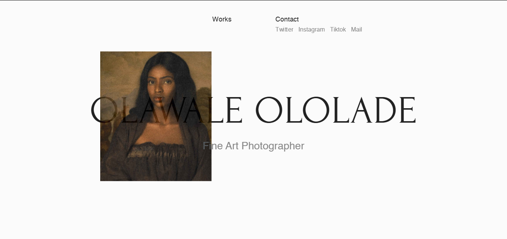
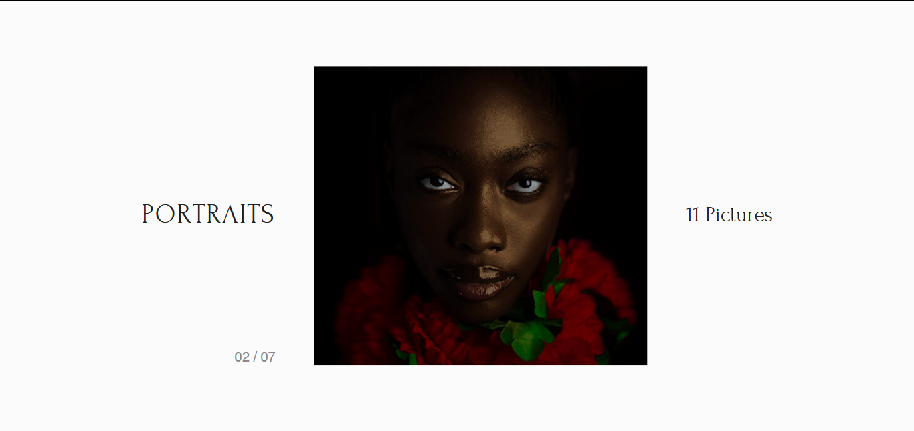
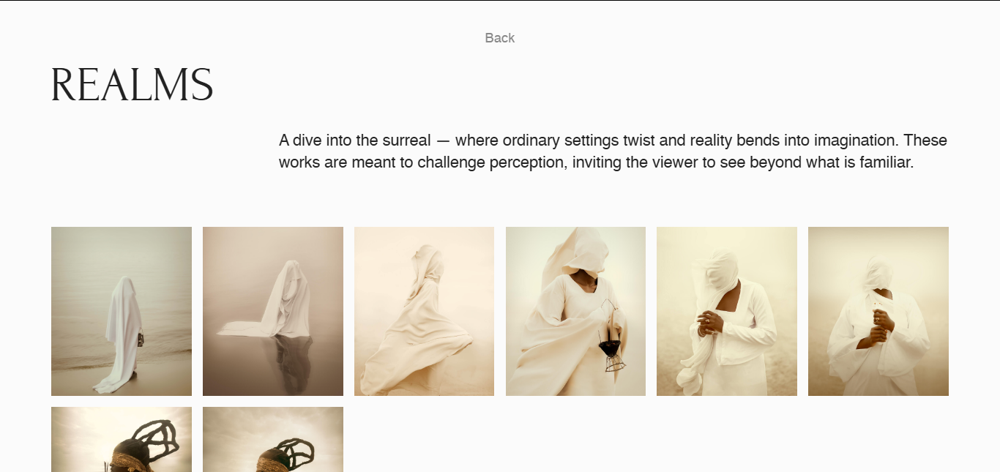

# Minimalist Portfolio Website for Olawale Ololade

## Overview

A responsive portfolio website designed for Olawale to showcase his work. The site highlights projects across categories (portraits, surrealism, painterly and more) with a focus on minimalist layout.

## Features

- Interactive image galleries with smooth transitions
- Organized project categories
- Responsive design optimized for desktop and mobile
- Image optimization for fast loading

## Tech Stack

- Frontend: React, CSS, GSAP, Framer Motion
- Deployment: Netlify

## Screenshots

## Live Site

[Visit Live Site](https://olawale-ololade.netlify.app)
